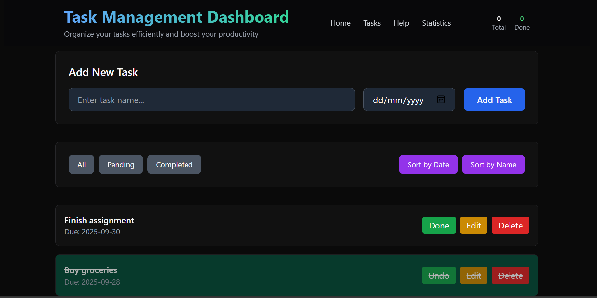
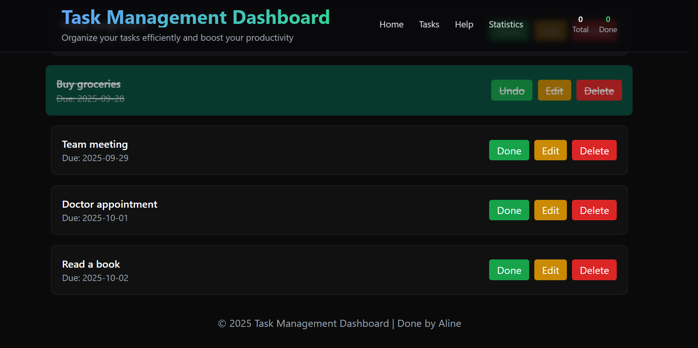

# Task Management Dashboard 

##  Overview
The **Task Management Dashboard** is a simple web application built with **HTML5, Tailwind CSS, and JavaScript**.  
It allows users to **add, edit, delete, filter, sort, and complete tasks** while saving them in **LocalStorage**, so tasks remain after refreshing the page.  

## purpose of the project
This project was created as part of an assignment to practice **DOM manipulation, event handling, and persistence in JavaScript**.  

---

##  Features
-  Preloaded with 5 sample tasks.  
-  Add new tasks with a name and due date.  
-  Edit task details.  
-  Delete tasks with confirmation.  
-  Mark tasks as **Completed** or **Pending**.  
-  Filter tasks → **All, Completed, Pending**.  
-  Sort tasks → **By due date or by name**.  
-  Persistent storage using **LocalStorage**.  
-  Responsive UI styled with **Tailwind CSS**.  
-  Overdue tasks are highlighted in red.  

---

## Screenshot
  
  
  

---
## Deployment
deployed link
[
     https://ualine055.github.io/Task-management-dashboard/
    
]

##  How to Run Locally
1. Clone this repository:
   ```bash
 [
   git clone https://github.com/Ualine055/Task-management-dashboard.git
 ]